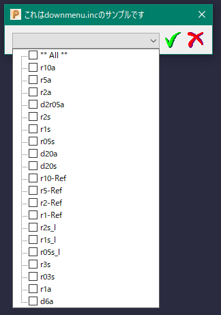

# ***PowerMill-downmenu***
これは、オートデスクソフトウェア「PowerMill」のマクロ用ライブラリです。

手軽にマクロの要素選択用プルダウンメニューを作成する為のもので、
単体で使用するためのものではありません。

### インストール:
[こちら](http://help.autodesk.com/view/PWRM/2020/JPN/?guid=GUID-68932D88-863A-407C-91CA-C9C82CB4A99D)の手順に従ってください。

### 使用法:
単体で使用するためのものではない為、「sample.mac」をご覧ください。

### 特徴：
標準の[input choice multip] 関数の戻り値は、選択された項目のインデックスの為扱いにくいです。　
その為、選択された項目を文字列リストとして返すようにしています。　
又、選択項目の先頭に「'** All **'」を追加し全選択を簡単に行えるようにしています。

### アクション:
以下の環境で確認しています。
 + Autodesk PowerMill Standard 2020.1.0.2020113
 + Windows10 64bit Pro

### ライセンス:
+ MIT

### 謝辞:
+ 日本サポートさん、いつもありがとう御座います